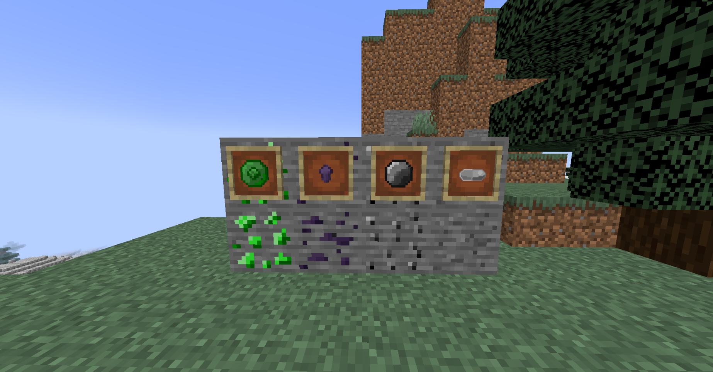

# SlightlyMoreOres

### Add some more fun to your Minecraft world with this mod!

# Usage

Ores will spawn in normally on world generation, no extra work is needed.

# Weapons & Toolsets

Ruby Set  
Sapphire Set  
Emerald Set  
Amethyst Set  
Rose Quartz Set 

# Armor Sets

Ruby Set  
Sapphire Set  
Emerald Set  
Amethyst Set

# Dependancies

[Minecraft Forge](https://files.minecraftforge.net/net/minecraftforge/forge/index_1.19.2.html)

# Installation

Simply drop into mods folder  
Tested on 1.20.1  
Server support not tested

# Future Plans

I've created a [Trello page](https://trello.com/b/TUeaZN1d/slightlymoreores) that you can use to track my progress on ideas I have for this project.

# Acknowledgments

[MCreator](https://mcreator.net) - The utility for most of the code  
[MC Forge](https://files.minecraftforge.net/net/minecraftforge/forge/index_1.20.1.html) - The mod engine

# Feedback

Questions? Bugs? Open an issue on the repo

